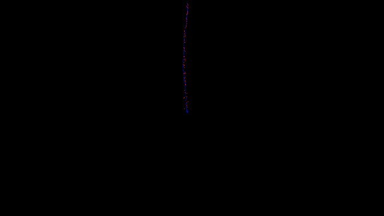
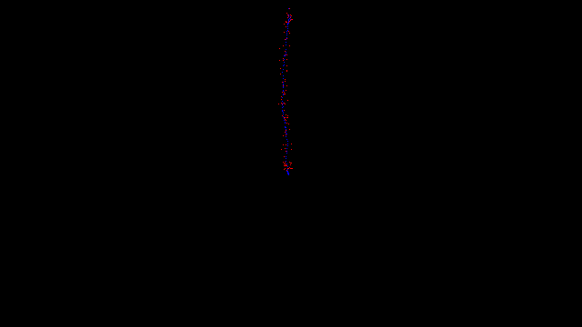

## Linear kalman filter
[](https://godoc.org/github.com/LdDl/kalman-filter) [](https://sourcegraph.com/github.com/LdDl/kalman-filter?badge) [](https://goreportcard.com/report/github.com/LdDl/kalman-filter) [](https://github.com/LdDl/kalman-filter/releases)[](https://travis-ci.com/LdDl/kalman-filter)

## Table of Contents

- [About](#about)
- [Installation](#installation)
- [Usage](#usage)
- [Support](#support-and-contribution)
- [Dependencies](#dependencies)
- [License](#license)
- [Devs](#developers)

## About

This is just linear [kalman filter](https://en.wikipedia.org/wiki/Kalman_filter) implementation in Go.
It contains simple 2-D based (point) tracker also.

## Installation
Simply:
```shell
go get github.com/LdDl/kalman-filter
```

## Usage
File [point_tracker_test.go](point_tracker_test.go) contains two examples for usage Kalman filter with 2-d based datasets:

* [point_tracker_test.go](point_tracker_test.go#L15) - stands for example with no noise addition to data

    Ouput:

    

* [point_tracker_test.go](point_tracker_test.go#L77) - stands for with noise addition to data

    Ouput:

    

## Support and contribution

If you have troubles or questions please [open an issue](https://github.com/LdDl/kalman-filter/issues/new).

PR's are welcome.

## Dependencies
* Matrix computations - [gonum](https://github.com/gonum/gonum#gonum). License is **BSD 3-Clause "New" or "Revised" License**. [Link](https://github.com/gonum/gonum/blob/master/LICENSE)
* Errors wraping - [errors](https://github.com/pkg/errors#errors-----). License is **BSD 2-Clause "Simplified" License**. [Link](https://github.com/pkg/errors/blob/master/LICENSE)

## License
License of this library is [MIT](https://en.wikipedia.org/wiki/MIT_License).

You can check it [here](LICENSE.md)

## Developers

LdDl https://github.com/LdDl

Pavel7824 https://github.com/Pavel7824

morozka https://github.com/morozka
